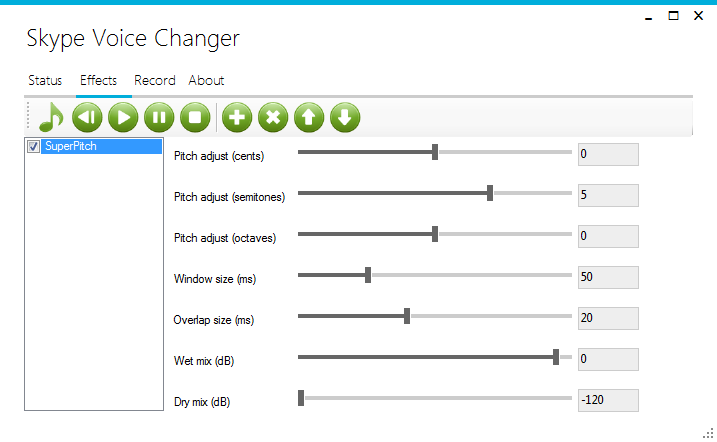

# Skype Voice Changer

Skype Voice Changer allows you to modify your voice in real-time during a Skype conversation. It works on Windows with the desktop 
version of Skype. Click the Download link on the right to install it. For  information about the "Pro" version which also lets you
record your conversations, visit [this page](https://skypevoicechanger.net).

**For Developers:**
Skype Voice Changer demonstrates how to use NAudio and Skype4COM to allow real-time effects processing of your voice during a Skype
conversation. It is developed in C#. It was initially developed to accompany [Mark Heath's](https://markheath.net) Coding4Fun
article: [Skype Voice Changer](http://blogs.msdn.com/coding4fun/archive/2009/02/02/9391048.aspx). It demonstrates the use
of [NAudio](https://github.com/naudio/NAudio/) for audio playback and sample manipulation. Eventually, it is intended that the 
effects framework in this project will become part of the core NAudio library.
